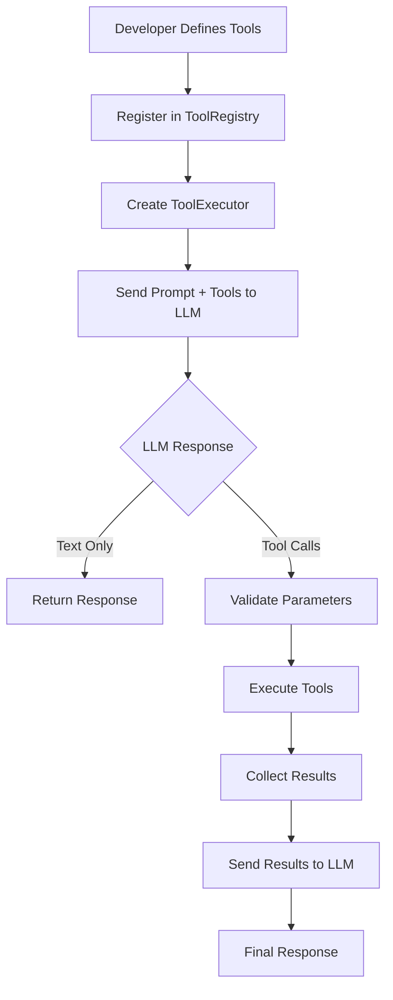
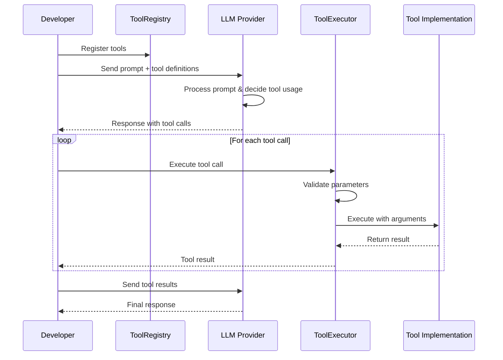
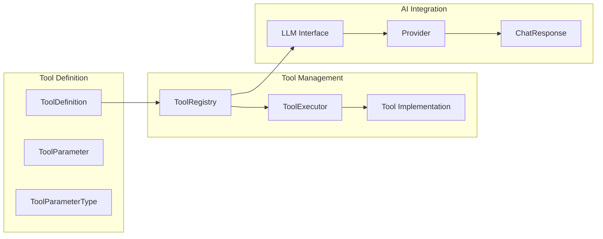

# Tool Calling Architecture in Orchestra-rs

This document provides a comprehensive overview of the tool calling architecture in Orchestra-rs, explaining how AI models can execute external functions and tools in a type-safe, efficient manner.

## Table of Contents

1. [Overview](#overview)
2. [Architecture Components](#architecture-components)
3. [Workflow Diagrams](#workflow-diagrams)
4. [Integration with AI Models](#integration-with-ai-models)
5. [Developer Guide](#developer-guide)
6. [Best Practices](#best-practices)
7. [Error Handling Strategy](#error-handling-strategy)
8. [Performance Considerations](#performance-considerations)

## Overview

Tool calling enables AI models to extend their capabilities beyond text generation by executing external functions, APIs, and services. Orchestra-rs provides a robust, type-safe framework for defining, registering, and executing tools that AI models can call dynamically.

### Key Benefits

- **Type Safety**: Rust's type system ensures tool definitions and executions are safe at compile time
- **Async Support**: Non-blocking tool execution for better performance
- **Validation**: Automatic parameter validation against tool schemas
- **Error Recovery**: Comprehensive error handling with retry strategies
- **Extensibility**: Easy to add new tools and providers
- **Monitoring**: Built-in performance tracking and debugging

## Architecture Components

### 1. Tool Definition Layer

```rust
// Tool definitions describe what tools are available
pub struct ToolDefinition {
    pub name: String,           // Unique tool identifier
    pub description: String,    // What the tool does
    pub parameters: HashMap<String, ToolParameter>, // Input schema
    pub deprecated: bool,       // Lifecycle management
}

// Parameters define input validation rules
pub struct ToolParameter {
    pub name: String,
    pub parameter_type: ToolParameterType,
    pub required: bool,
    pub constraints: ValidationRules,
}
```

**Purpose**: Provides a declarative way to define tool capabilities and input requirements.

### 2. Tool Registry

```rust
pub struct ToolRegistry {
    tools: Arc<RwLock<HashMap<String, BoxedTool>>>,
    categories: Arc<RwLock<HashMap<String, Vec<String>>>>,
}
```

**Purpose**: 
- Central repository for all available tools
- Thread-safe concurrent access
- Tool discovery and categorization
- Schema generation for AI models

### 3. Tool Execution Engine

```rust
pub struct ToolExecutor {
    registry: ToolRegistry,
    timeout_duration: Duration,
    validate_parameters: bool,
    include_timing: bool,
}
```

**Purpose**:
- Safe tool execution with validation
- Timeout management
- Error handling and recovery
- Performance monitoring

### 4. Provider Integration

```rust
pub trait Provider {
    async fn chat_with_tools(
        &self,
        model_config: ModelConfig,
        message: Message,
        chat_history: Vec<Message>,
        tools: Vec<ToolDefinition>,
    ) -> Result<ChatResponse>;
}
```

**Purpose**: Integrates tool definitions with AI model providers (Gemini, OpenAI, etc.)

## Workflow Diagrams

### High-Level Tool Calling Flow



### Detailed Execution Flow



### Component Interaction



## Integration with AI Models

### 1. Tool Schema Generation

Orchestra-rs automatically generates JSON schemas that AI models can understand:

```json
{
  "tools": [
    {
      "type": "function",
      "function": {
        "name": "calculator",
        "description": "Performs basic arithmetic operations",
        "parameters": {
          "type": "object",
          "properties": {
            "operation": {
              "type": "string",
              "enum": ["add", "subtract", "multiply", "divide"]
            },
            "a": {"type": "number"},
            "b": {"type": "number"}
          },
          "required": ["operation", "a", "b"]
        }
      }
    }
  ]
}
```

### 2. Provider-Specific Implementation

Each AI provider has specific requirements for tool calling:

#### Gemini Integration

```rust
// Gemini-specific tool format
pub struct GeminiFunctionDeclaration {
    pub name: String,
    pub description: String,
    pub parameters: serde_json::Value, // JSON schema
}

// Convert Orchestra tools to Gemini format
impl From<&ToolDefinition> for GeminiFunctionDeclaration {
    fn from(tool_def: &ToolDefinition) -> Self {
        Self {
            name: tool_def.name.clone(),
            description: tool_def.description.clone(),
            parameters: tool_def.to_json_schema(),
        }
    }
}
```

### 3. Response Parsing

AI models return tool calls in their responses:

```rust
pub struct ChatResponse {
    pub text: String,
    pub tool_calls: Option<Vec<ToolCall>>, // Parsed tool calls
    pub metadata: Option<ChatResponseMetadata>,
}

pub struct ToolCall {
    pub id: String,
    pub function: ToolFunction,
}

pub struct ToolFunction {
    pub name: String,
    pub arguments: serde_json::Value,
}
```

## Developer Guide

### Step 1: Define Your Tool

```rust
use orchestra_core::tools::{Tool, ToolDefinition, ToolParameter, ToolParameterType, ToolResult};
use async_trait::async_trait;
use serde_json::{json, Value};

#[derive(Debug)]
struct WeatherTool {
    definition: ToolDefinition,
    api_key: String,
}

impl WeatherTool {
    fn new(api_key: String) -> Self {
        let definition = ToolDefinition::new(
            "get_weather",
            "Get current weather information for a location"
        )
        .with_parameter(
            ToolParameter::new("location", ToolParameterType::String)
                .with_description("City and country (e.g., 'Paris, France')")
                .required()
        )
        .with_parameter(
            ToolParameter::new("units", ToolParameterType::String)
                .with_enum_values(vec!["celsius", "fahrenheit"])
                .with_default(json!("celsius"))
        );

        Self { definition, api_key }
    }
}

#[async_trait]
impl Tool for WeatherTool {
    fn definition(&self) -> &ToolDefinition {
        &self.definition
    }

    async fn execute(&self, arguments: Value) -> Result<ToolResult> {
        let location = arguments["location"].as_str()
            .ok_or_else(|| OrchestraError::config("Missing location"))?;
        
        let units = arguments.get("units")
            .and_then(|v| v.as_str())
            .unwrap_or("celsius");

        // Call external weather API
        let weather_data = self.fetch_weather(location, units).await?;
        
        Ok(ToolResult::success(weather_data))
    }
}

impl WeatherTool {
    async fn fetch_weather(&self, location: &str, units: &str) -> Result<serde_json::Value> {
        // Implementation would call actual weather API
        // This is a simplified example
        Ok(json!({
            "location": location,
            "temperature": 22,
            "units": units,
            "condition": "sunny"
        }))
    }
}
```

### Step 2: Register and Use Tools

```rust
use orchestra_core::{
    llm::LLM,
    tools::{ToolRegistry, ToolExecutor, boxed_tool},
};

#[tokio::main]
async fn main() -> Result<(), Box<dyn std::error::Error>> {
    // 1. Create and register tools
    let registry = ToolRegistry::new();
    let weather_tool = WeatherTool::new("your-api-key".to_string());
    registry.register(boxed_tool(weather_tool))?;

    // 2. Create LLM and executor
    let llm = LLM::gemini("gemini-2.5-flash");
    let executor = ToolExecutor::new(registry.clone());

    // 3. Get tool definitions for LLM
    let tools = registry.tool_definitions();

    // 4. Send prompt with tools
    let response = llm.prompt_with_tools(
        "What's the weather like in Tokyo?",
        tools
    ).await?;

    // 5. Execute any tool calls
    if response.has_tool_calls() {
        for tool_call in response.get_tool_calls() {
            let result = executor.execute(
                &tool_call.function.name,
                tool_call.function.arguments.clone()
            ).await?;
            
            println!("Tool result: {}", result.to_string());
        }
    }

    Ok(())
}
```

### Step 3: Handle Complex Workflows

```rust
async fn complex_workflow() -> Result<()> {
    let llm = LLM::gemini("gemini-2.5-flash");
    let registry = create_comprehensive_registry().await?;
    
    // Multi-turn conversation with tool calling
    let mut conversation = Vec::new();
    let mut current_prompt = "Plan a trip to Paris including weather and restaurant recommendations".to_string();
    
    loop {
        let response = llm.chat_with_tools(
            Message::human(&current_prompt),
            conversation.clone(),
            registry.tool_definitions()
        ).await?;
        
        conversation.push(Message::human(&current_prompt));
        
        if response.has_tool_calls() {
            // Execute tools and add results to conversation
            let mut tool_results = Vec::new();
            
            for tool_call in response.get_tool_calls() {
                let result = execute_tool_with_retry(
                    &registry,
                    &tool_call.function.name,
                    &tool_call.function.arguments
                ).await?;
                
                tool_results.push(format!("Tool {}: {}", 
                    tool_call.function.name, 
                    result.to_string()
                ));
            }
            
            // Add tool results to conversation
            conversation.push(Message::assistant(&response.text));
            conversation.push(Message::human(&format!(
                "Tool results: {}", 
                tool_results.join("; ")
            )));
            
            current_prompt = "Continue with the plan based on these results".to_string();
        } else {
            // Final response without tool calls
            println!("Final plan: {}", response.text);
            break;
        }
    }
    
    Ok(())
}
```

## Best Practices

### 1. Tool Design Principles

#### Single Responsibility
Each tool should have a single, well-defined purpose:

```rust
// Good: Specific, focused tool
struct GetWeatherTool { /* ... */ }

// Bad: Too broad, multiple responsibilities
struct WeatherAndNewsAndStocksTool { /* ... */ }
```

#### Idempotency
Tools should be idempotent when possible:

```rust
impl Tool for ReadFileTool {
    async fn execute(&self, arguments: Value) -> Result<ToolResult> {
        // Reading a file is idempotent - same input, same output
        let path = arguments["path"].as_str().unwrap();
        let content = tokio::fs::read_to_string(path).await?;
        Ok(ToolResult::success(json!({"content": content})))
    }
}
```

#### Clear Error Messages
Provide actionable error messages:

```rust
// Good: Specific, actionable error
if !path.exists() {
    return Ok(ToolResult::error_with_details(
        format!("File not found: {}", path.display()),
        ToolError::new(ToolErrorType::NotFound, "File does not exist")
            .with_context("path", json!(path.to_string_lossy()))
            .with_context("suggestion", json!("Check if the file path is correct"))
    ));
}

// Bad: Vague error
return Ok(ToolResult::error("Something went wrong"));
```

### 2. Parameter Validation

#### Use Strong Typing
Define clear parameter types and constraints:

```rust
let email_param = ToolParameter::new("email", ToolParameterType::String)
    .with_description("Valid email address")
    .with_length_range(Some(5), Some(254))
    .required();

let age_param = ToolParameter::new("age", ToolParameterType::Integer)
    .with_description("Age in years")
    .with_range(Some(0.0), Some(150.0))
    .required();
```

#### Validate Business Logic
Don't rely only on type validation:

```rust
async fn execute(&self, arguments: Value) -> Result<ToolResult> {
    let email = arguments["email"].as_str().unwrap();

    // Type validation happens automatically, but add business logic validation
    if !is_valid_email_format(email) {
        return Ok(ToolResult::error_with_details(
            "Invalid email format",
            ToolError::new(ToolErrorType::InvalidInput, "Email validation failed")
        ));
    }

    // Continue with execution...
}
```

### 3. Async Best Practices

#### Use Timeouts
Always set reasonable timeouts for external calls:

```rust
use tokio::time::{timeout, Duration};

async fn call_external_api(&self, url: &str) -> Result<serde_json::Value> {
    let request = reqwest::get(url);

    match timeout(Duration::from_secs(30), request).await {
        Ok(Ok(response)) => Ok(response.json().await?),
        Ok(Err(e)) => Err(OrchestraError::network(&format!("Request failed: {}", e))),
        Err(_) => Err(OrchestraError::timeout("API call timed out after 30 seconds")),
    }
}
```

#### Handle Concurrent Execution
Design tools to handle concurrent execution safely:

```rust
use std::sync::Arc;
use tokio::sync::Semaphore;

struct RateLimitedTool {
    semaphore: Arc<Semaphore>, // Limit concurrent executions
    // ... other fields
}

impl RateLimitedTool {
    async fn execute(&self, arguments: Value) -> Result<ToolResult> {
        let _permit = self.semaphore.acquire().await?;
        // Tool execution with rate limiting
        self.do_work(arguments).await
    }
}
```

### 4. Error Recovery Strategies

#### Implement Retry Logic
For transient failures, implement intelligent retry:

```rust
async fn execute_with_retry<F, Fut>(
    operation: F,
    max_retries: u32,
    base_delay: Duration,
) -> Result<ToolResult>
where
    F: Fn() -> Fut,
    Fut: Future<Output = Result<ToolResult>>,
{
    for attempt in 1..=max_retries {
        match operation().await {
            Ok(result) if result.is_success() => return Ok(result),
            Ok(result) if result.error_details.as_ref()
                .map_or(false, |e| e.retryable) => {
                // Exponential backoff
                let delay = base_delay * 2_u32.pow(attempt - 1);
                tokio::time::sleep(delay).await;
                continue;
            }
            result => return result, // Non-retryable error or success
        }
    }

    Ok(ToolResult::error("Max retries exceeded"))
}
```

#### Circuit Breaker Pattern
Prevent cascading failures:

```rust
use std::sync::atomic::{AtomicU32, Ordering};
use std::time::Instant;

struct CircuitBreaker {
    failure_count: AtomicU32,
    last_failure: Arc<Mutex<Option<Instant>>>,
    failure_threshold: u32,
    recovery_timeout: Duration,
}

impl CircuitBreaker {
    async fn call<F, Fut>(&self, operation: F) -> Result<ToolResult>
    where
        F: FnOnce() -> Fut,
        Fut: Future<Output = Result<ToolResult>>,
    {
        if self.is_open().await {
            return Ok(ToolResult::error("Circuit breaker is open"));
        }

        match operation().await {
            Ok(result) if result.is_success() => {
                self.reset().await;
                Ok(result)
            }
            result => {
                self.record_failure().await;
                result
            }
        }
    }
}
```

## Error Handling Strategy

### Error Types Hierarchy

```rust
pub enum ToolErrorType {
    InvalidInput,      // Bad parameters from user/LLM
    Authentication,    // API key issues
    Network,          // Connectivity problems
    ExternalService,  // Third-party service errors
    Internal,         // Our code bugs
    Timeout,          // Operation took too long
    RateLimit,        // Too many requests
    NotFound,         // Resource doesn't exist
    PermissionDenied, // Access forbidden
    Unknown,          // Unexpected errors
}
```

### Error Context

Always provide rich context for debugging:

```rust
Ok(ToolResult::error_with_details(
    "Failed to fetch user data",
    ToolError::new(ToolErrorType::ExternalService, "API returned 404")
        .with_context("user_id", json!(user_id))
        .with_context("api_endpoint", json!(endpoint))
        .with_context("timestamp", json!(Utc::now().to_rfc3339()))
        .with_context("retry_after", json!(300)) // seconds
        .retryable()
))
```

### Graceful Degradation

Design tools to degrade gracefully:

```rust
async fn get_enhanced_weather(&self, location: &str) -> Result<ToolResult> {
    // Try premium weather service first
    match self.premium_weather_api.get_weather(location).await {
        Ok(data) => Ok(ToolResult::success(data)),
        Err(_) => {
            // Fall back to basic weather service
            match self.basic_weather_api.get_weather(location).await {
                Ok(basic_data) => Ok(ToolResult::success(json!({
                    "data": basic_data,
                    "note": "Using basic weather data due to premium service unavailability"
                }))),
                Err(e) => Ok(ToolResult::error(format!("All weather services unavailable: {}", e)))
            }
        }
    }
}
```

## Performance Considerations

### 1. Caching Strategies

#### Result Caching
Cache expensive operations:

```rust
use std::collections::HashMap;
use std::sync::Arc;
use tokio::sync::RwLock;

struct CachedTool {
    cache: Arc<RwLock<HashMap<String, (ToolResult, Instant)>>>,
    cache_ttl: Duration,
}

impl CachedTool {
    async fn execute(&self, arguments: Value) -> Result<ToolResult> {
        let cache_key = self.generate_cache_key(&arguments);

        // Check cache first
        {
            let cache = self.cache.read().await;
            if let Some((result, timestamp)) = cache.get(&cache_key) {
                if timestamp.elapsed() < self.cache_ttl {
                    return Ok(result.clone());
                }
            }
        }

        // Execute and cache result
        let result = self.execute_uncached(arguments).await?;

        {
            let mut cache = self.cache.write().await;
            cache.insert(cache_key, (result.clone(), Instant::now()));
        }

        Ok(result)
    }
}
```

### 2. Connection Pooling

Reuse connections for external services:

```rust
use reqwest::Client;
use std::sync::Arc;

struct HttpTool {
    client: Arc<Client>, // Reused across requests
}

impl HttpTool {
    fn new() -> Self {
        let client = Client::builder()
            .timeout(Duration::from_secs(30))
            .pool_max_idle_per_host(10)
            .build()
            .expect("Failed to create HTTP client");

        Self {
            client: Arc::new(client),
        }
    }
}
```

### 3. Monitoring and Metrics

Track tool performance:

```rust
use std::sync::atomic::{AtomicU64, Ordering};

struct ToolMetrics {
    execution_count: AtomicU64,
    total_duration: AtomicU64,
    error_count: AtomicU64,
}

impl ToolMetrics {
    fn record_execution(&self, duration: Duration, success: bool) {
        self.execution_count.fetch_add(1, Ordering::Relaxed);
        self.total_duration.fetch_add(duration.as_millis() as u64, Ordering::Relaxed);

        if !success {
            self.error_count.fetch_add(1, Ordering::Relaxed);
        }
    }

    fn average_duration(&self) -> Duration {
        let count = self.execution_count.load(Ordering::Relaxed);
        let total = self.total_duration.load(Ordering::Relaxed);

        if count == 0 {
            Duration::from_millis(0)
        } else {
            Duration::from_millis(total / count)
        }
    }
}
```

## Conclusion

Orchestra-rs provides a comprehensive, type-safe framework for tool calling that integrates seamlessly with AI models. The architecture emphasizes:

- **Safety**: Rust's type system prevents runtime errors
- **Performance**: Async execution with proper resource management
- **Reliability**: Comprehensive error handling and recovery
- **Extensibility**: Easy to add new tools and providers
- **Observability**: Built-in monitoring and debugging capabilities

By following the patterns and best practices outlined in this document, developers can build robust AI applications that safely and efficiently execute external tools and services.

For more examples and detailed API documentation, see:
- [Basic Tool Calling Example](orchestra-core/examples/tool_calling.rs)
- [Advanced Patterns Example](orchestra-core/examples/advanced_tool_patterns.rs)
- [API Documentation](https://docs.rs/orchestra-core)
